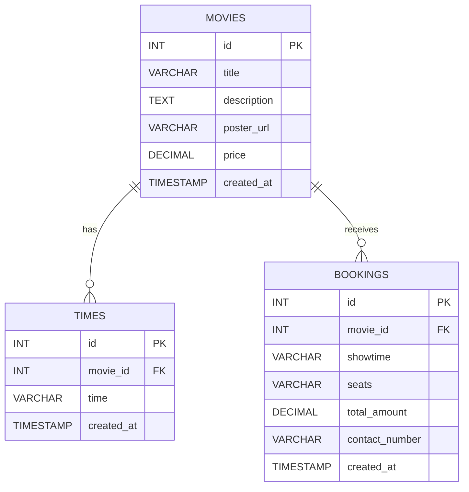

# Online Movie Ticket Booking System

## Group Information

- **Course:** DBMS Project
- **Group Number:** -
- **Project Name:** Online Movie Ticket Booking System

### Group Members

| Name | ID | Section | Role |
|------|----|---------|------|
| Member 1 | - | - | Frontend + Integration |
| Member 2 | - | - | Backend API |
| Member 3 | - | - | Database + Testing |

## Individual Contribution

> This section carries marks. Keep this honest and specific.

| Member | Contribution |
|--------|--------------|
| Fadia Rahman Jule (241-115-067) | Frontend deployment and implementation using Netlify. |
| Mst. Fariha Jahan Rifat (241-115-074) | Worked on frontend (Netlify), backend implementation in PHP with Railway deployment, and database setup in Supabase PostgreSQL. |
| Anusree Chando Tuly (241-115-093) | Worked on frontend (Netlify and CSS) and contributed to Supabase database tasks. |
| Maisha Tarannum Newaz (241-115-095) | Worked on backend implementation using PHP and Railway deployment. |

## Project Objective

The objective of this project is to build a full-stack movie ticket booking platform where users can browse movies, choose showtimes, book seats, and store booking data in a relational database.  
The system demonstrates practical DBMS concepts such as table design, foreign keys, CRUD operations, and real-time persistence through a deployed application.

## Functionalities Implemented

### Frontend
- Browse available movies with poster, description, and ticket price.
- Search/filter movies.
- Select a movie and showtime.
- Seat selection interface.
- Booking form with contact number validation.
- Booking confirmation/receipt view.
- Responsive UI using Tailwind CSS.

### Backend
- `GET /api/movies` - fetch all movies.
- `POST /api/movies` - create movie.
- `POST /api/movies/update` - update movie.
- `POST /api/movies/delete` - delete movie.
- `POST /api/bookings` - create booking.
- `GET /api/health` - service health check.

### Database (PostgreSQL / Supabase)
- `movies` table for movie metadata.
- `times` table for showtimes.
- `bookings` table for booked seats and customer info.
- Foreign key relationships and index usage for efficient queries.

## Brief Architecture

- **Frontend:** React + Vite (`frontend/`)
- **Backend:** PHP API (`backend/`)
- **Database:** Supabase PostgreSQL
- **Deployment:** Frontend on Netlify, Backend on Railway

## Important Database Queries Used

- Insert new movie.
- Update movie details.
- Delete movie by id.
- Fetch all movies ordered by creation time.
- Insert booking with `movie_id`, `showtime`, `seats`, `total_amount`, and `contact_number`.

## ER Diagram



> If Mermaid is not rendered on your GitHub view, export this into an image (`.png`) and add it to the repo as `docs/er-diagram.png`, then embed it here.

## Video Demonstration

- **Project Demo Video Link:** -

### Video must show:
- All functionalities.
- Brief frontend explanation.
- Brief backend explanation.
- Database queries and data changes in Supabase.

## Repository Contents

- Full source code (frontend + backend)
- SQL schema/setup files
- ER diagram (Mermaid in README)
- Deployment/config documentation

## How to Run (Quick)

```bash
git clone https://github.com/FarihaRifat/Online-Movie-Ticket-Booking.git
cd Online-Movie-Ticket-Booking
```

Then follow deployment steps in `DEPLOYMENT_README.md`.

---

## Notes for Final Submission

- Keep this repository public.
